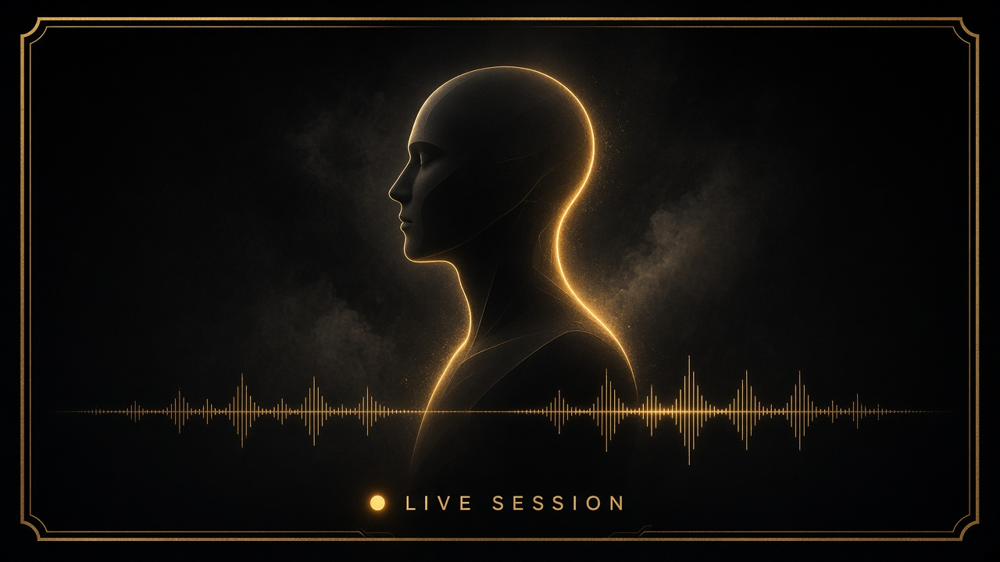
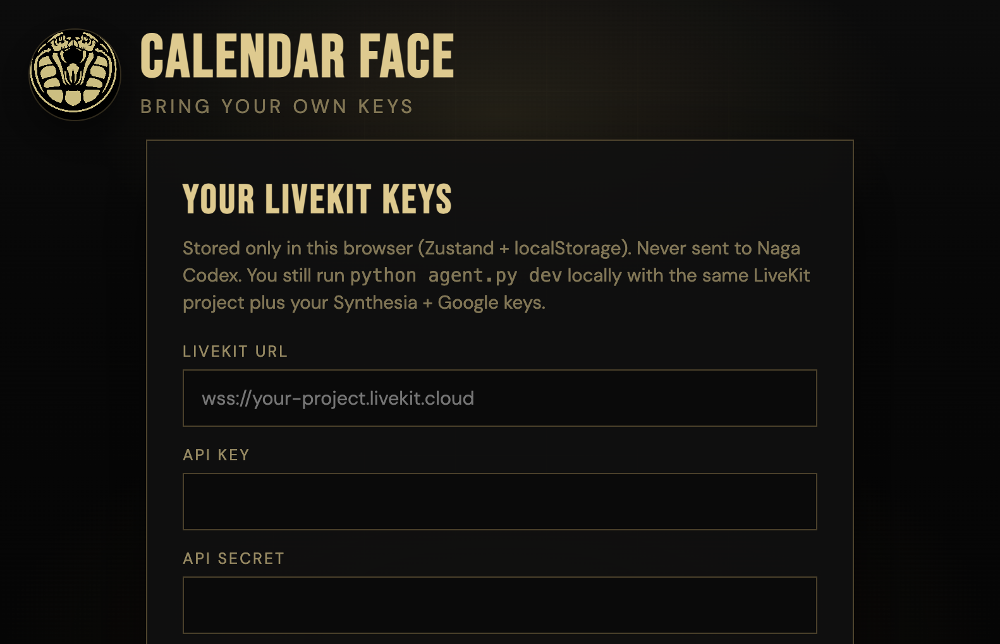
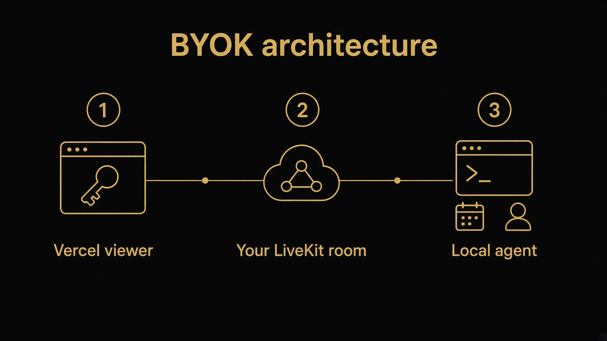

# Calendar Face

<p align="center">
  
</p>

A real-time AI avatar that reads (and can create/reschedule) Google Calendar events and holds you accountable.

Built on [LiveKit Agents](https://docs.livekit.io/agents/) + [Synthesia Interactive Avatars](https://www.synthesia.io/features/avatars/interactive-avatars). Inspired by [this tutorial](https://youtu.be/xQoJA9_1EXA).

**Powered by [Naga Codex](https://www.nagacodex.cloud/).**  
**Live viewer:** [web-seven-tawny-63.vercel.app](https://web-seven-tawny-63.vercel.app)

<p align="center">
  
</p>

## Bring your own keys (BYOK)

This project is meant to be **self-hosted by each user**.  
You do **not** put your LiveKit / Synthesia / Google keys in the public app.

| Who | Pays for |
|-----|----------|
| Each end user | Their own LiveKit project, Synthesia Interactive Avatars, Google Cloud (free tier is usually enough) |
| You (repo author) | Nothing — as long as you never ship a hosted demo wired to *your* `.env` |

Do **not** deploy one shared Cloud agent with your API keys and let strangers use it. That bills **you**.

## What each user needs

1. **LiveKit Cloud** project → URL + API key + secret ([cloud.livekit.io](https://cloud.livekit.io))
2. **Synthesia** API key with **Interactive Avatars** scope ([docs](https://docs.synthesia.io/docs/developers))
3. **Google Cloud** OAuth Desktop client + Calendar API enabled → save as `credentials.json`

## Setup

```bash
git clone <your-repo-url>
cd avatar-face-for-google-calendar-main   # or your folder name
python3 -m venv .venv && source .venv/bin/activate
pip install -r requirements.txt
cp .env.example .env
```

Edit `.env` with **their** keys. Put Google’s downloaded OAuth JSON here as `credentials.json` (never commit it).

## Run locally

Terminal 1 — agent worker:

```bash
source .venv/bin/activate
python agent.py dev
```

First run opens Google login and writes `token.json` (local only).

Terminal 2 — branded viewer (optional, good for demos):

```bash
source .venv/bin/activate
python view_avatar.py
```

Open http://127.0.0.1:8765 → **Connect once** (Synthesia plans often allow only 1 concurrent avatar session).

Or use LiveKit Cloud → Agents → select the agent named like `LIVEKIT_AGENT_NAME` → Launch Console.

## Env vars

See [`.env.example`](.env.example):

- `SYNTHESIA_API_KEY` — required  
- `SYNTHESIA_AVATAR_ID` — optional gallery id  
- `LIVEKIT_URL` / `LIVEKIT_API_KEY` / `LIVEKIT_API_SECRET` — required  
- `LIVEKIT_AGENT_NAME` — must match the agent name used in LiveKit dispatch/Console  

## Web viewer (Vercel + BYOK in the browser)

<p align="center">
  
</p>

<p align="center">
  
</p>

The `web/` app stores **LiveKit URL / API key / secret / agent name** in the user’s browser via Zustand + `localStorage`. Tokens are minted client-side — nothing is sent to Naga Codex servers.

Users still must run the Python agent locally (Synthesia + Google keys stay on their machine):

```bash
python agent.py dev
```

Then open the Vercel site → paste **their** LiveKit keys → Connect.

**What the Vercel URL does / does not do**

| Works on the URL alone? | Piece |
|-------------------------|--------|
| Yes | BYOK form, room join, token minting in-browser |
| Only with local `agent.py` | Synthesia **face + voice**, calendar tools |
| Needs 1 free Synthesia session | Interactive avatar video (close other Consoles/tabs) |

```bash
cd web && npm install && npm run build
# deploy: cd web && npx vercel --prod
```

| Piece | Where keys live | Who pays |
|-------|-----------------|----------|
| Vercel viewer | User browser (LiveKit only) | User’s LiveKit project |
| `agent.py` | User `.env` (LiveKit + Synthesia + Google) | User |

## Deploy options (still BYOK)

| Option | Use when | Your keys exposed? |
|--------|----------|--------------------|
| **Local run** (above) | Friends, open-source users, demos on their machine | No |
| **Vercel viewer + local agent** | Share a UI URL; each user brings LiveKit keys | No |
| **User deploys agent to their LiveKit Cloud** | They want the worker always-on | No |
| **Your hosted multi-tenant SaaS** | Product with accounts + billing | Don’t do this casually |

## Security checklist before `git push`

- [ ] `.env`, `credentials.json`, `token.json`, `client_secret*.json` are gitignored  
- [ ] `.env.example` has empty placeholders only  
- [ ] No real keys in README, commits, or screenshots  
- [ ] If keys were ever pasted into chat/files that were shared, **rotate** them in LiveKit + Synthesia  

## License / credit

Demo UI branding includes a local `logo.png`.  
Powered by [Naga Codex](https://www.nagacodex.cloud/).
